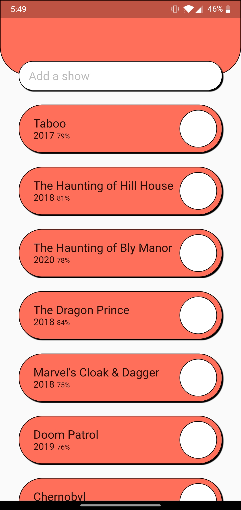
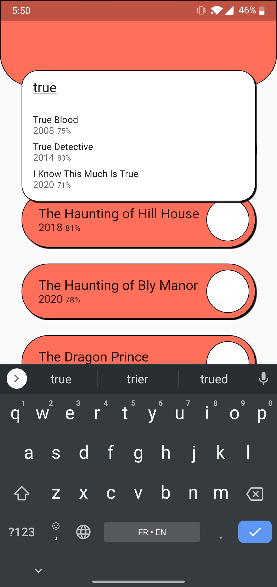

# Watchlist

App built with Flutter to track your content to watch

Stores the data in a spreadsheet of the user's Google Drive called `Watchlist`

Gets the data from [TheMovieDB](https://www.themoviedb.org/)

